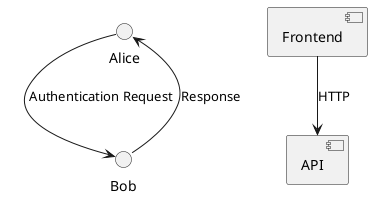

# PlantUML Diagrams

Generate UML diagrams from text with the `puml` CLI and embed them as figures in the report. Use this for architecture, sequence, class, component, use-case, activity, and state diagrams.

## Prerequisites

The `puml` command comes from the `node-plantuml` npm package:

```bash
npm install -g node-plantuml
```

It shells out to PlantUML, which needs Java (`java` on PATH). Some diagram types (class/component with certain layouts) also need Graphviz `dot`. Sequence, activity, and use-case diagrams render without Graphviz.

Verify:

```bash
puml --version
```

## Writing a diagram

Write the PlantUML source to a `.puml` file (e.g. `diagrams/arquitectura.puml`), then render it to PNG or SVG:

```bash
puml generate diagrams/arquitectura.puml -p -o images/arquitectura.png   # PNG
puml generate diagrams/arquitectura.puml -s -o images/arquitectura.svg   # SVG (vector)
```

Common diagram types:



## Embedding in the report

Reference the rendered image as a figure (project-root relative paths):

```typst
#figure(
  image("images/arquitectura.png", width: 90%),
  caption: [Arquitectura del sistema],
)
```

## Guidelines

- Prefer SVG for crisp vector output; use PNG if the diagram embeds raster content or Typst reports a format issue. `magick` (ImageMagick) can convert SVG→PNG if needed.
- Keep diagrams focused: one concern per diagram. A single big diagram is harder to read than several small ones.
- Name files by content (`secuencia-login.puml`, `clases-modelo.puml`).
- Put `.puml` sources under `diagrams/` (or `src/` if they are part of the code submission) and rendered images under `images/`.
- Do not commit rendered images that can be regenerated from `.puml` sources unless the report needs them; the report references images, so keep the ones the report uses.
